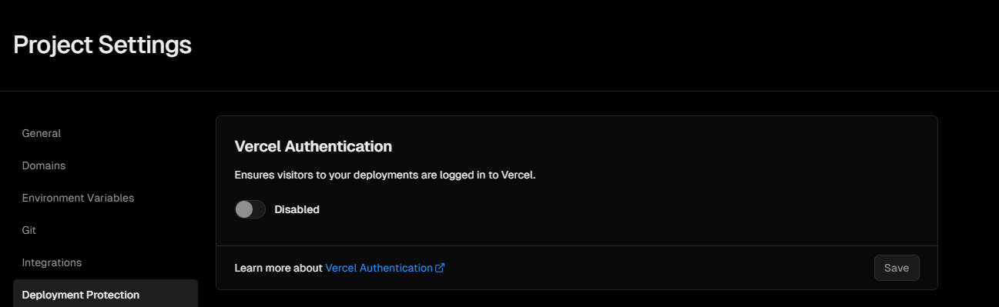

# Simple Static Hosting

Simple Static Hosting is a lightweight tool to manage and host static files. It provides an easy-to-use file tree interface and supports hosting static files for free.

## Features

1. **File Tree Viewer:** Visualize and navigate your project's file structure.
2. **Static File Hosting:** Host static files easily with a simple button click.
3. **Copy HTML Tags:** Quickly copy HTML tags for js, css, and image files to embed them in your HTML.

# Getting Started

1. Fork this repository.
2. Clone your forked repository to your local machine.

### Configure data.json

Before deploying your Simple Static Hosting project, customize the `data.json` file with your specific file tree structure. The `data.json` file contains information about your project's files and folders.

Example structure:

```json
[
  { "fileName": "script.js", "description": "Description for file 1", "type": "js" },
  { "fileName": "domain.js", "description": "Description for file 1", "type": "js" },
  { "fileName": "style.css", "description": "Description for file 2", "type": "css" },
  {
    "fileName": "images", "type": "folder", "children": [
    { "fileName": "kirby.png", "description": "Kirby Image", "type": "image" },
    { "fileName": "denne.png", "description": "Denne Image", "type": "text" }
  ]
  },
  {
    "fileName": "pomodoro", "type": "folder", "children": [
    { "fileName": "pomodoro.js", "description": "Pomodoro js", "type": "js" },
    { "fileName": "style.css", "description": "Pomodoro css", "type": "css" }
  ]
  }
]
```

## Deployment

### Method 1: Using Vercel CLI
**Prerequisites**
- [Vercel CLI](https://vercel.com/docs/cli) (for deployment)

1. Run `vercel login` to log in to Vercel CLI.
2. Run `vercel --prebuilt` to deploy your project.

### Method 2: Vercel Site Deployment

1. Visit [Vercel](https://vercel.com/) and log in to your account.
2. Click "Connect to Git Repository."
3. Authorize Vercel's access to your GitHub repositories.
4. Select your Static Hosting repository.
5. Confirm the repository connection.

## Deployment Protection

1. Visit Vercel Deployment Settings : https://vercel.com/{your_name}/{project_name}/settings/deployment-protection.

2. Under "Vercel Authentication," find the toggle switch.

3. Toggle the switch to the **disabled** position.

4. Save the changes.


   
### Vercel Documentation

For more details on deploying and configuring static files, refer to the [Vercel Documentation](https://vercel.com/docs/build-output-api/v3/primitives#static-files).
